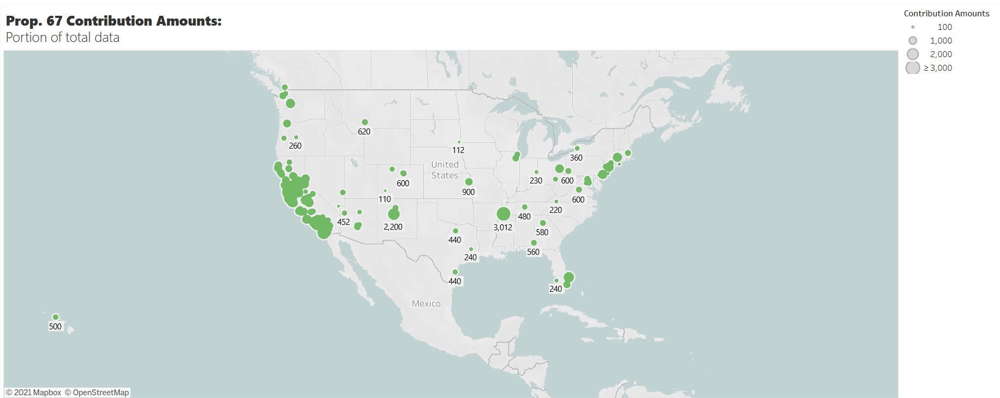
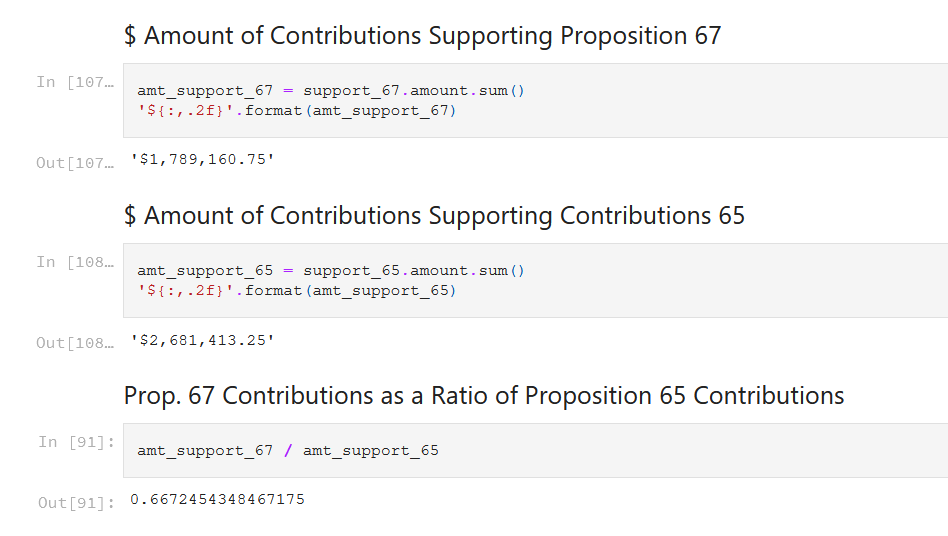
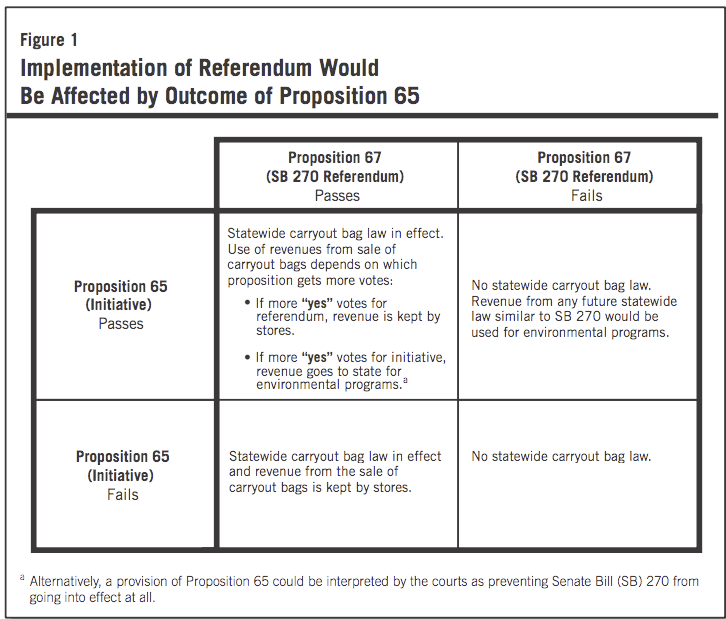

### Findings in political campaign data from 2016. Data visualization on California's 2016 Propositions 67 and 65.

*Khalil Abdellah*

[cv-net/plastic-bag-props](https://github.com/cv-net/plastic-bag-props)

This project is the product of an introductory course to data journalism, [First Python Notebook](https://www.firstpythonnotebook.org/about/index.html). First Python Notebook used data from the [California Civic Data Coalition (CCDC)](https://www.californiacivicdata.org/), which cleans and organizes publicly available political campaign finance data from the state of California (CAL-ACCESS). The course focused on data from California's 2016 Ballot Propositions, interviewing the data and visualizing it with Python Jupyter Notebook, emphasizing the journalistic knowledge and sense needed to interpret the data responsibly. 

For example, the data provided by [CAL-ACCESS](http://cal-access.ss.ca.gov/) only reports campaign contributions greater than $100. The course only provided half of the complete contribution data, as the other half were early contributions from 2013-14, likely not necessary for the aims of the introductory course. 

Even with missing data, the visualization for Proposition 67's contributions (Figure 1) may perhaps be considered representative of the many, small donations made to the proposition. I was able to acquire and clean the missing data from Proposition 65, and all of it is reflected in Figure 2.

The visualizations below were created in Tableau, after geocoding the data based on the ZIP codes provided in the CCDC dataset.

---

In California, there were twin propositions on the 2016 ballot, Propositions 65 and 67. Proposition 67 represented a vote on Senate Bill 270, which was a ban on single-use plastic carryout bags in grocery stores. Under SB-270, single-use plastic bags would be replaced with re-usable bags, which would be for sale to grocery store customers. 

Proposition 65 presented as a more sustainable version of Proposition 67 in its ballot narrative. In actuality, both propositions were only on the ballot because Prop. 65 challenged to veto SB-270 altogether

It may have seemed, to an uninformed voter, that the main difference between Propositions 65 and 67 was about where the revenue from selling re-usable bags would go. 

Proposition 67 was a vote on the ban itself, and said that the revenue would go back to grocery store owners, to cover their costs for manufacturing and procuring the bags, and educating customers on sustainable shopping. 

Interviewing the campaign finance data provided by CCDC and reading the official ballot narratives made it clear that Proposition 65 and its plastic-producing backers had clandestine (however obvious) motivations.

Proposition 65 said that the revenue from re-usable bag sales would go to an Environmental Protection and Enhancement Fund (EPEF). 

*"The Wildlife Conservation Board would have utilized the fund for environmental protection and grants to environmental conservation organizations. Grants could have been used for drought mitigation; clean drinking water supplies; recycling; litter removal; wildlife habitat restoration; beach cleanup; and state, regional, and local parks." - Ballotpedia.com*

Though the EPEF seems a worthwhile cause, environmentalist support [largely fell with Proposition 67](https://ballotpedia.org/California_Proposition_67,_Plastic_Bag_Ban_Veto_Referendum_(2016)#Support_for_.22yes.22_vote). That's a hint into the story of the twin propositions, which the campaign finance data will begin to clarify. 

This is a first look at the campaign finance data, provided by the California Civic Data Coalition. It immediately stuck out that the same 5 contributors that supported Proposition 65, opposed Proposition 67. This was because all of the contributions for Proposition 65 were registered in direct opposition to Proposition 67. 

**Figure 1**, a screenshot from the Python notebook for the project. Available on Github.

These 5 companies contributed to the one committee sponsoring the proposition, the American Progressive Bag Alliance.

Proposition 65 didn't have any contributions against it, probably because it wouldn't have been worth taking focus away from Proposition 67.

### Prop. 65 - CARRY-OUT BAGS. CHARGES. INITIATIVE STATUTE

**Figure 2**, available on [Tableau Public.](https://public.tableau.com/profile/khalil6901#!/vizhome/Prop65sSupportingCommitteesandContributions/Sheet1)

- Contributions supporting Prop. 65 averaged $99,311.60 (27 contributions) which is, on average, over 300x higher than those supporting Prop. 67.

### "STOP THE SWEETHEART BAG TAX DEAL. HELP THE ENVIRONMENT"

The official ballot argument for Proposition 65 that was presented to voters claimed that grocery stores would profit from selling paper bags in place of plastic bags. Prop. 65's redirection of funds from grocery stores to the EPEF claimed to prevent profiteering, to keep the environmentalist effort pure. 

The opposing argument was that the revenue from selling paper bags would have covered the grocery stores' costs for buying the bags and providing environmentally educational material to customers, which Prop. 67 mandated.

*Prop. 65 official ballot narrative, presented to voters in the booth*

**"DON'T BE FOOLED BY PROP 67.** 
It is a $300 million per year HIDDEN TAX INCREASE on California consumers who will be forced to pay a minimum 10 cents for every paper and thick plastic grocery bag they are given at the checkout.
And not one penny goes to the environment. Instead, the Legislature gave all $300 million in new tax revenue to grocers as extra profit.
Stop the sweetheart special interest deal... **VOTE NO ON PROP 67. "**

Proposition 67 had many small contributors, largely from California residents. 

### Prop. 67 - REFERENDUM TO OVERTURN BAN ON SINGLE-USE PLASTIC BAGS.

**Figure 3**, available on [Tableau Public.](https://public.tableau.com/profile/khalil6901#!/vizhome/Prop67Contributions/Sheet1)

- 6,252 in support out of 6,279 total contributions, 99%
- Average contribution of $286.17

**Figure 4**, from [Money in Politics : An Analysis of 2016 California Ballot Propositions Contributions by Serigne Mourtallah M'backe Faye, 2021](https://github.com/mourtallah/CA-Ballot-Props) 

When looking at all the California ballot propositions in 2016, Prop. 67 was on the higher end with 6,000+ contributors, as opposed to Prop. 65's five contributors.

**Figure 5,** Screenshot from the Python notebook for the project, available on Github.

- Prop. 67 raised only about 2/3 of what Prop. 65 raised, which was largely done by the four plastics producers.

### 67 vs. 65

We find a story about the two propositions, and narratives about contributor motives on [Ballotpedia](https://ballotpedia.org/California_Proposition_65,_Dedication_of_Revenue_from_Disposable_Bag_Sales_to_Wildlife_Conservation_Fund_(2016)).

**Figure 6**, from [Ballotpedia](https://ballotpedia.org/California_Proposition_65,_Dedication_of_Revenue_from_Disposable_Bag_Sales_to_Wildlife_Conservation_Fund_(2016)): 

Prop. 65 would have only succeeded in its surface aims if it both props won, and 65 succeeded with a greater margin than67's winning margin. 

There was a quirk in Section 6(a) of Prop. 65 that meant that if Prop. 67 failed while Prop. 65 passed, then there would be no plastic bag ban in the first place. 

The opposing argument presented on the ballot accused Proposition 65 and its supporters of trying to confuse voters into voting against the plastic bag ban altogether. This is supported when we look at who contributed: four plastics companies, against the citizens of California. 

*Prop. 67 official ballot narrative, presented to voters in the booth.*

"**YES on 67 to REDUCE LITTER, PROTECT OUR OCEAN and WILDLIFE, and REDUCE CLEAN-UP COSTS.**
Single-use plastic shopping bags create some of the most visible litter that blows into our parks, trees and neighborhoods, and washes into our rivers, lakes and ocean. A YES vote will help keep discarded plastic bags out of our mountains, valleys, beaches and communities, and keep them beautiful. The law also will save our state and local  communities tens of millions of dollars in litter clean-up costs.

**OUT-OF-STATE PLASTIC BAG COMPANIES ARE OPPOSING CALIFORNIA'S PROGRESS**
Opposition to this law is funded by four large out-of-state state plastic bag companies. They don't want California to take leadership on plastic bag waste, and are trying to defeat this measure to protect their profits.
Don't believe their false claims. We should give California's plastic bag law a chance to work, especially with so much success already at the local level."

### Political Trickery

In this story, a few plastic bag companies making up the APBA put their money together and created a misleading proposition to sabotage the Prop. 67 plastic bag ban. That Prop. 65 was listed in opposition to Prop. 67, and that Prop. 65 was sponsored by plastic bag companies, says that 65 suggest was disingenuous in its framing. The APBA's proposition 65 claimed to be even more environmentalist than the initial plastic bag ban. In fact, Prop. 65 was as profit-driven and environmentally destructive as it accused Prop. 67 of being. The APBA was the real 'sweetheart', trying to meet its own needs at the public's expense. 

The story of Propositions 67 and 65 is important because it's an example of political tricks at the state level. Politicians use disingenuous narratives and [use policies as bargaining chips](https://www.theverge.com/2020/12/29/22204976/section-230-senate-deal-stimulus-talks-checks) for partisan aims. 

### Citations:

- [Money in Politics : An Analysis of 2016 California Ballot Propositions Contributions by Serigne Mourtallah M'backe Faye, 2021](https://github.com/mourtallah/CA-Ballot-Props)
- [California Proposition 65, Dedication of Revenue from Disposable Bag Sales to Wildlife Conservation Fund (2016)](https://ballotpedia.org/California_Proposition_65,_Dedication_of_Revenue_from_Disposable_Bag_Sales_to_Wildlife_Conservation_Fund_(2016))
- [Data provided by the California Civic Data Coalition via First Python Notebook (Ben Welsh, 2020)](https://www.firstpythonnotebook.org/)
- [California governor signs phase-out of plastic bags by Patrick McGreevy (2014)](https://www.chicagotribune.com/nation-world/chi-california-governor-plastic-bag-ban-20140930-story.html)

export default;